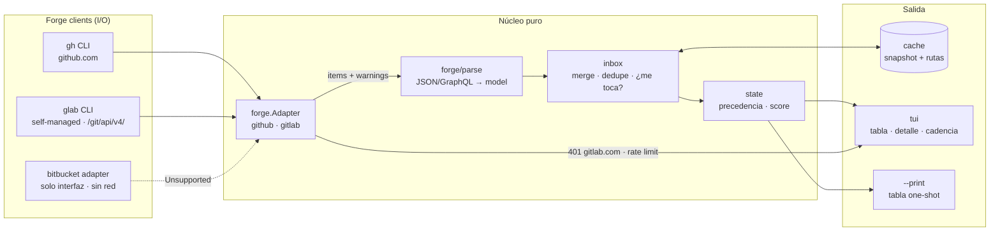
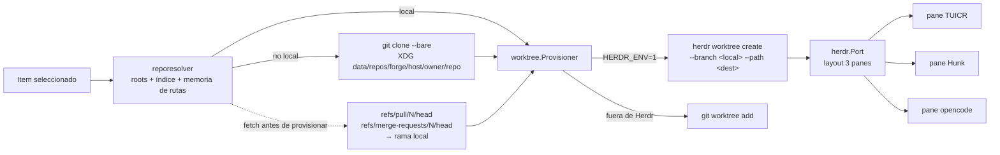

# Flujo de datos — prdash MVP

Dos recorridos: (1) el pipeline del inbox y (2) la provisión del review.
La capa pura (parse/inbox/state/plan) no toca red, disco ni subprocess.

## 1. Pipeline del inbox (F1)

## 2. Provisión del worktree de review (F2)

**Fronteras**
- `reporesolver` es el único dueño del namespace de rutas (clon bare + worktrees).
- Solo el puerto `herdr` conoce la CLI nativa y aloja el fallback a git.
- El fetch del ref ocurre SIEMPRE antes de provisionar (ver ADR `docs/adr/0001-worktree-provisioning.md`).
