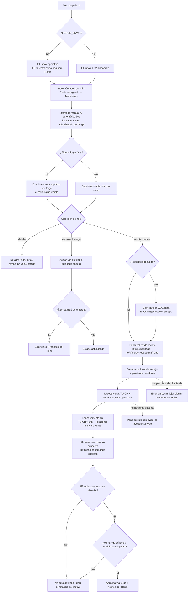

# Flujo de comportamiento — prdash MVP

Derivado de `behavior.feature`. Recorrido del usuario: inbox (F1), orquestador de review (F2),
degradación y gate de F3.

**Notas de comportamiento**
- "Vacío" y "error" nunca se confunden (falla explícita por forge/sección).
- Sin tope por sección: el inbox pagina hasta agotar, con carga progresiva.
- Fuera de Herdr, F1 no se degrada; solo F2 se informa.
