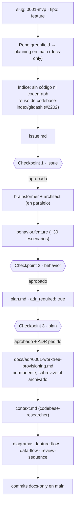
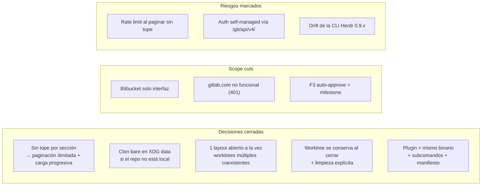

# Flujo de planning — 0001-mvp (prdash)

Proceso real seguido para ESTE cambio: `0001-mvp` (feature, greenfield), con sus
checkpoints, decisiones y cortes de alcance.

## Recorrido

## Decisiones, cortes y riesgos de este cambio

**Verificaciones que quedan para implementación**: `tuicr pr` submit contra self-managed;
`herdr worktree create` desde clon bare con `--path`; permisos approve/merge en el self-managed;
placement real del pane y link handler; fetch de refs de review en el host self-managed.
