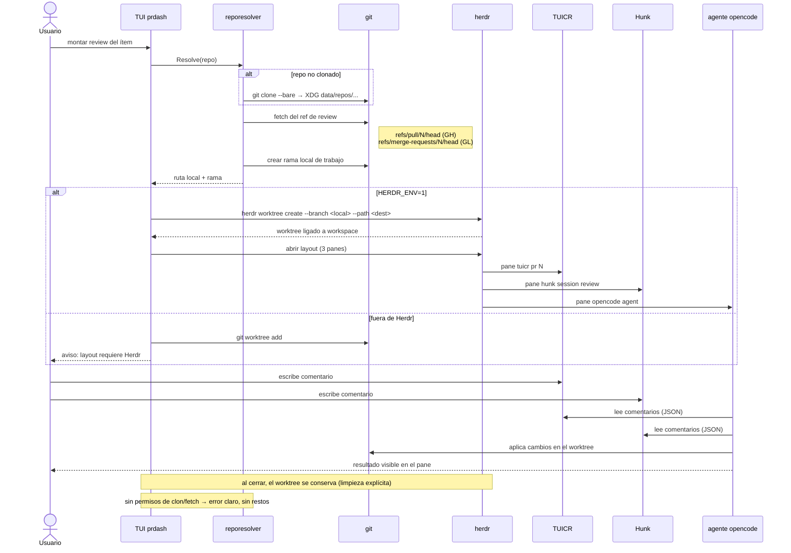

# Secuencia — montaje del layout de review y loop de comentarios

Recorrido de F2 desde la selección del ítem hasta el loop comento→agente.
Derivado de `behavior.feature` y del ADR `docs/adr/0001-worktree-provisioning.md`.

