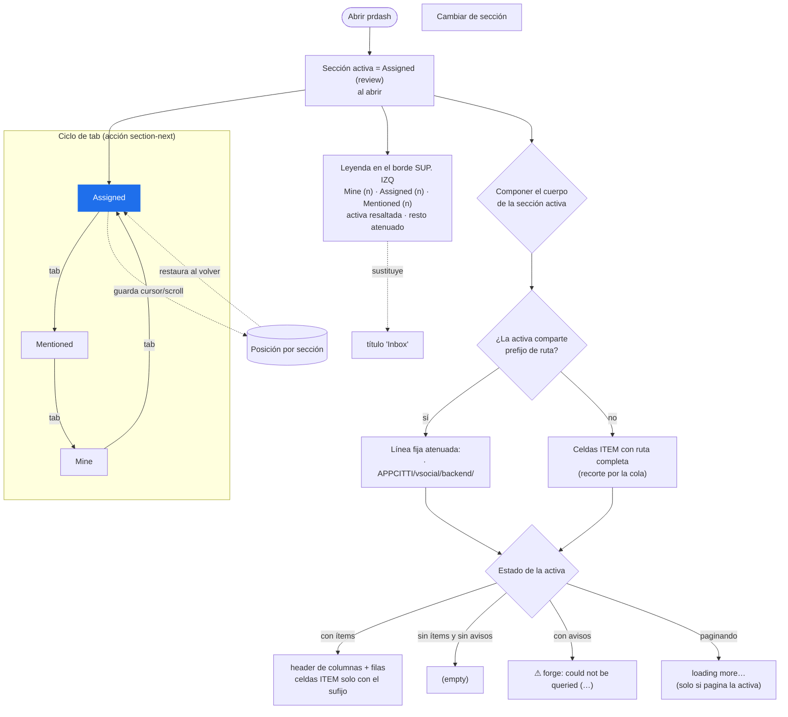

# Feature flow — 0002 Inbox de una sola sección

Flujo de comportamiento del Inbox, derivado de `behavior.feature`. Feature-aware:
una sola sección activa, leyenda de conteos y prefijo de ruta común de la activa.

Notas:
- Solo se pinta la sección activa; los avisos y el `loading more…` son de la
  activa (los de otras secciones no se pintan).
- El prefijo de ruta común se conserva (ADR 0002) y es la costura para el futuro
  prefijo seleccionable/toggleable (feature posterior).
