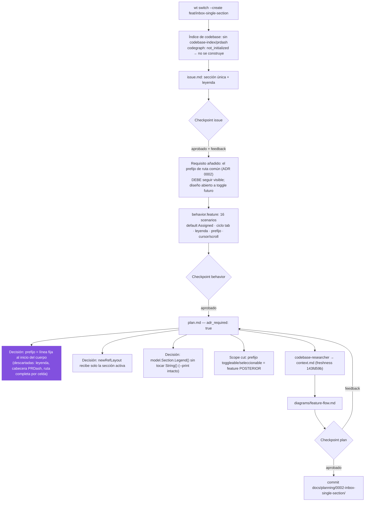

# Process flow — planificación de 0002-inbox-single-section

Flujo de planificación de ESTA feature (slug `0002-inbox-single-section`),
con las decisiones reales tomadas.

Decisiones registradas: `adr_required: true` → ADR propuesto
`docs/adr/0004-inbox-single-section.md` (supersede la cláusula del ADR 0002 que
ancla el prefijo en la cabecera de sección).
