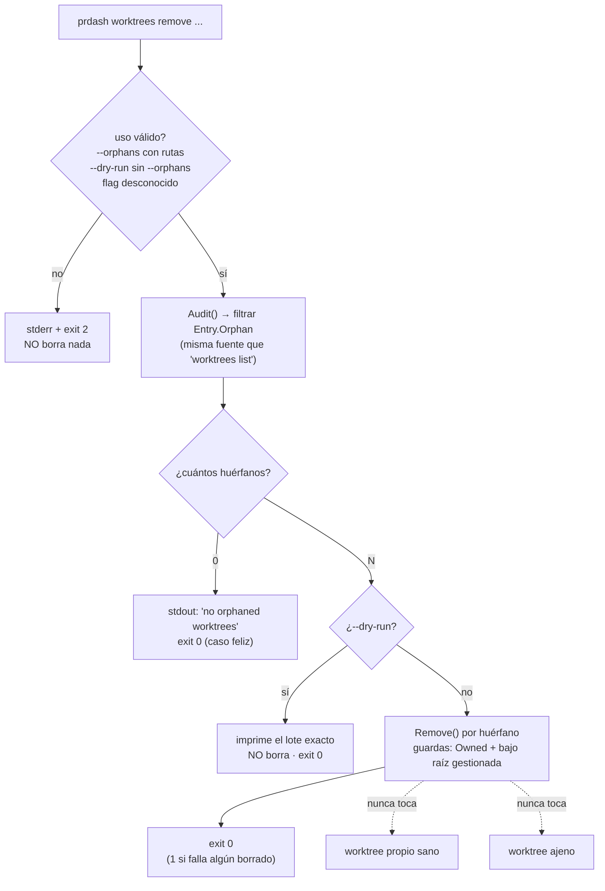
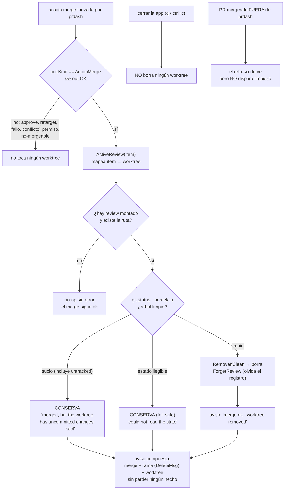
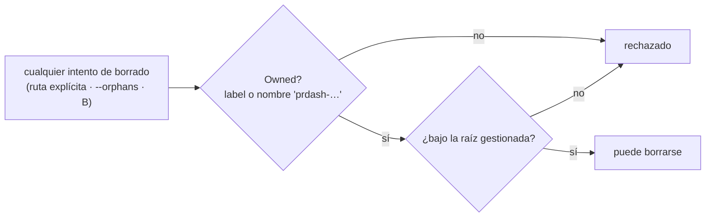

# Flujo de comportamiento — 0004 limpieza de worktrees

Derivado de `../behavior.feature`. No es Cucumber: es una vista del
comportamiento esperado para revisión humana.

## A — `prdash worktrees remove --orphans`

## B — auto-borrado al mergear **desde prdash**

## Guardas comunes a las dos vías

