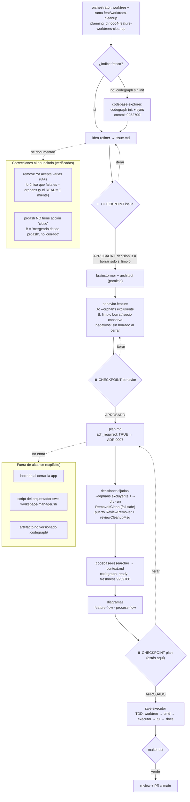

# Flujo de planning (feature-aware) — 0004 worktrees-cleanup

Recorrido real de esta feature por el pipeline `swe`, con las decisiones
tomadas. Slug: `worktrees-cleanup`. Tipo: `feature`. Rama: `feat/worktrees-cleanup`.

