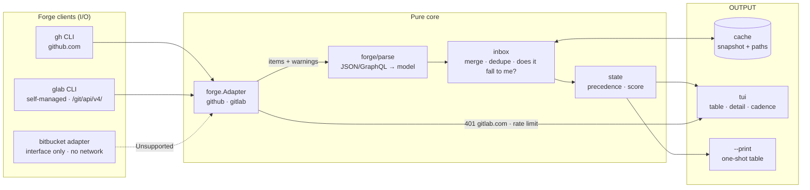
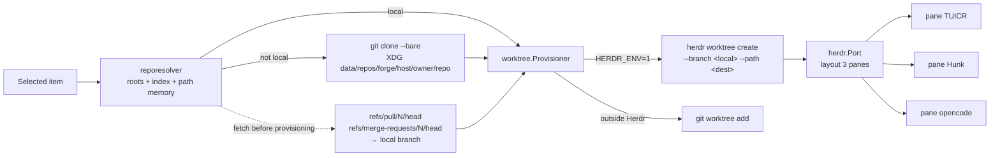

# Data flow — prdash MVP

Two paths: (1) the inbox pipeline and (2) the review provisioning.
The pure layer (parse/inbox/state/plan) touches neither network, disk nor
subprocess.

## 1. Inbox pipeline (F1)

## 2. Review worktree provisioning (F2)

**Boundaries**
- `reporesolver` is the sole owner of the path namespace (bare clone +
  worktrees).
- Only the `herdr` port knows the native CLI and hosts the git fallback.
- The ref fetch happens ALWAYS before provisioning (see ADR
  `docs/adr/0001-worktree-provisioning.md`).
