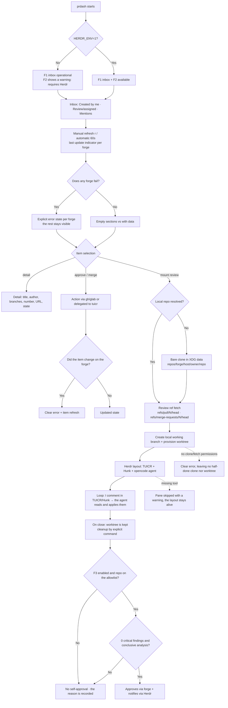

# Behavior flow — prdash MVP

Derived from `behavior.feature`. User path: inbox (F1), review orchestrator
(F2), degradation and the F3 gate.

**Behavior notes**
- "Empty" and "error" are never confused (explicit failure per
  forge/section).
- No per-section cap: the inbox paginates until exhausted, with progressive
  loading.
- Outside Herdr, F1 does not degrade; only F2 is reported.
