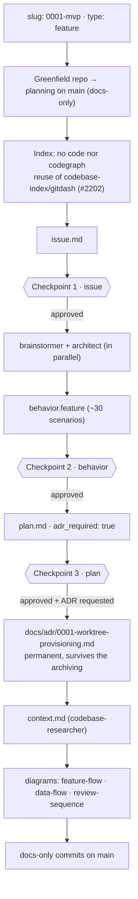
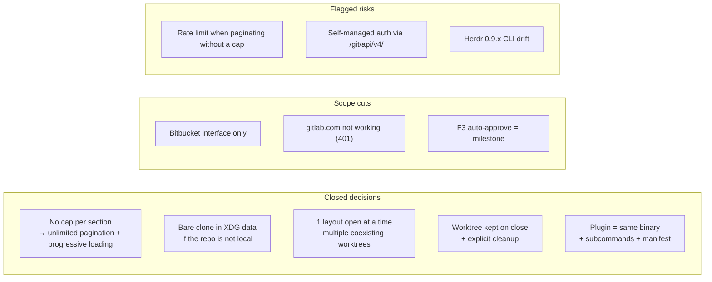

# Planning flow — 0001-mvp (prdash)

Real process followed for THIS change: `0001-mvp` (feature, greenfield), with
its checkpoints, decisions and scope cuts.

## Path

## Decisions, cuts and risks of this change

**Verifications left for implementation**: `tuicr pr` submit against
self-managed; `herdr worktree create` from a bare clone with `--path`;
approve/merge permissions on the self-managed; real placement of the pane and
link handler; fetch of review refs on the self-managed host.
