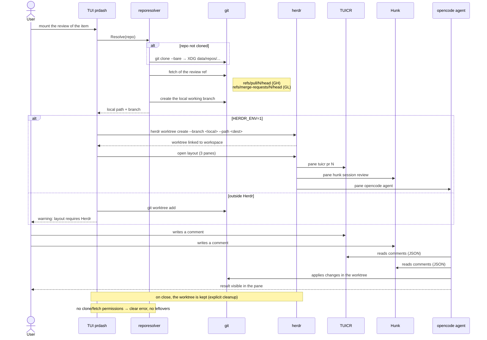

# Sequence — mounting the review layout and the comment loop

F2 path from the item selection to the comment→agent loop.
Derived from `behavior.feature` and the ADR
`docs/adr/0001-worktree-provisioning.md`.

