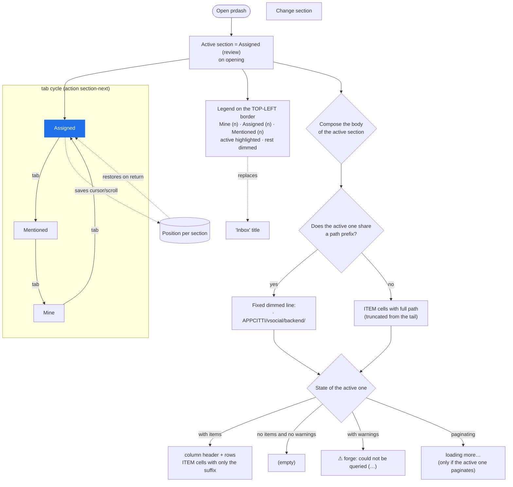

# Feature flow — 0002 single-section Inbox

Inbox behavior flow, derived from `behavior.feature`. Feature-aware: a single
active section, count legend and common path prefix of the active one.

Notes:
- Only the active section is painted; the warnings and the `loading more…`
  belong to the active one (the ones of other sections are not painted).
- The common path prefix is kept (ADR 0002) and it is the seam for the future
  selectable/toggleable prefix (a later feature).
