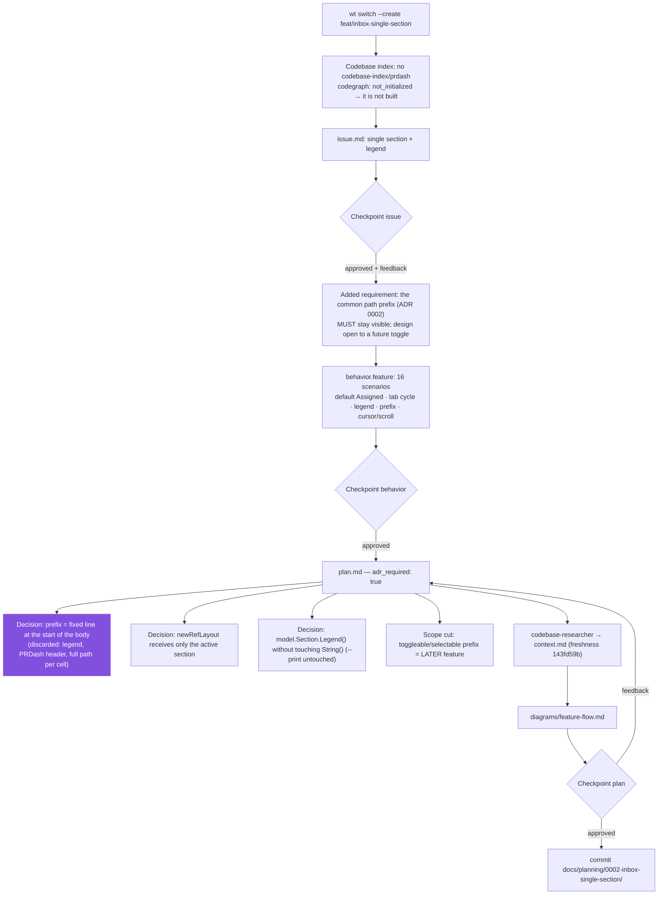

# Process flow — planning of 0002-inbox-single-section

Planning flow of THIS feature (slug `0002-inbox-single-section`), with the
real decisions taken.

Recorded decisions: `adr_required: true` → proposed ADR
`docs/adr/0004-inbox-single-section.md` (supersedes the clause of ADR 0002 that
anchors the prefix in the section header).
