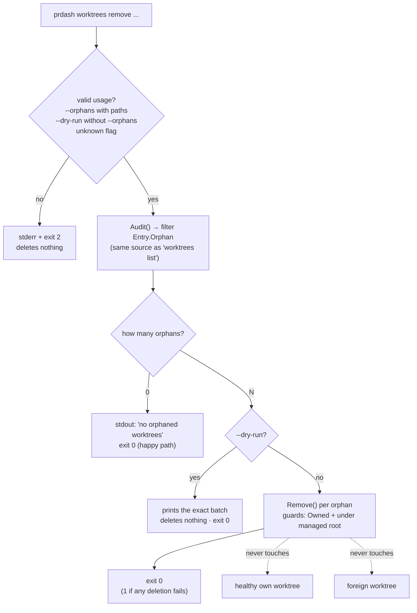
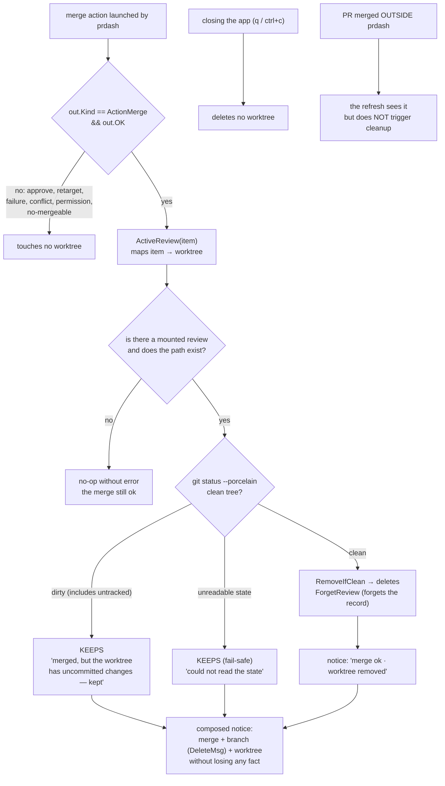
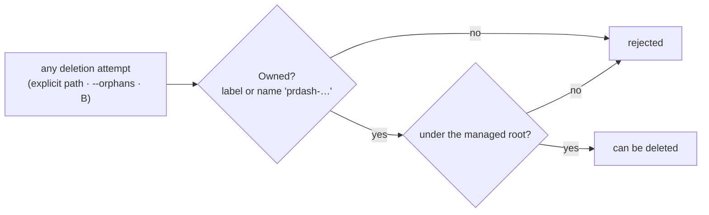

# Behavior flow — 0004 worktree cleanup

Derived from `../behavior.feature`. It is not Cucumber: it is a view of the
expected behavior for human review.

## A — `prdash worktrees remove --orphans`

## B — self-deletion on merge **from prdash**

## Common guards for the two paths

