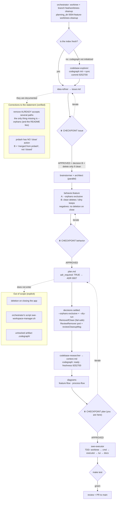

# Planning flow (feature-aware) — 0004 worktrees-cleanup

Real path of this feature through the `swe` pipeline, with the decisions
taken. Slug: `worktrees-cleanup`. Type: `feature`. Branch: `feat/worktrees-cleanup`.

